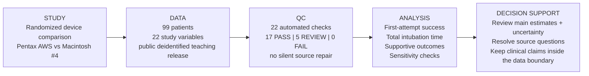

# Medical-device RCT case study — 2-minute review

## Study question

Can a short-cycle statistical data science workflow turn real patient-level randomized medical-device data into a result that a clinical study team can review and act on, while keeping source-data questions visible?

## What the released data show

| Question | Result | What I would tell the study team |
| --- | --- | --- |
| First-attempt success | AWS 43/50 (86.0%) vs Macintosh 45/49 (91.8%); risk difference -5.8 percentage points, 95% CI -19.0 to 7.2 | The released data do not show a first-attempt-success advantage for AWS; the interval is wide enough that clinically relevant differences in either direction remain possible. |
| Total intubation time | median 38.1 s vs 26.0 s; median difference +12.1 s, bootstrap 95% CI 7.0 to 22.5 | AWS is slower in this released dataset, and the result remains similar after the prespecified source-timing sensitivity check. |
| Adjusted time sensitivity | AWS/Macintosh time ratio 1.555, 95% CI 1.297 to 1.865; N=96 complete cases | The supportive adjusted result points in the same direction as the randomized unadjusted time comparison. |
| Data quality | 22 checks: 17 PASS, 5 REVIEW, 0 FAIL | The data are usable for the planned portfolio re-analysis, but five items should stay visible to the statistician/data manager rather than be silently edited. |

## Source questions kept open

The pipeline keeps one timing-definition inconsistency as a review item and does not assign a clinical interpretation to the public `view` code because the teaching dictionary wording is hard to reconcile with the expected grade ordering. Missing core values use explicit available-case denominators. Later-attempt fields are handled as structural missingness when a later attempt was not required.

## What is delivered

One R command downloads the public patient-level data, records provenance, builds analysis-ready data, runs QC, creates the randomized comparisons and sensitivity analyses, and produces review tables, figures and two short study-team reports. Executable checks verify the patient count, treatment counts, key event counts, missingness totals, expected review items and the main time estimate.

## Evidence boundary

This is an educational portfolio re-analysis of a redistributed 99-patient teaching release. The source publication reports 105 randomized patients. The work sample therefore does not claim an exact reproduction of the publication, new clinical evidence, a regulatory analysis, or sponsor/CRO production experience.

For the full technical record, see [`README.md`](README.md), [`spec/analysis_plan.md`](spec/analysis_plan.md), and [`DAY5_HANDOFF.md`](DAY5_HANDOFF.md).
